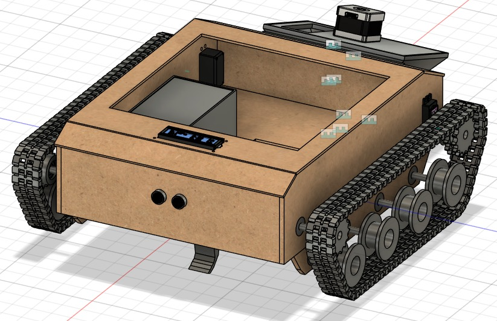
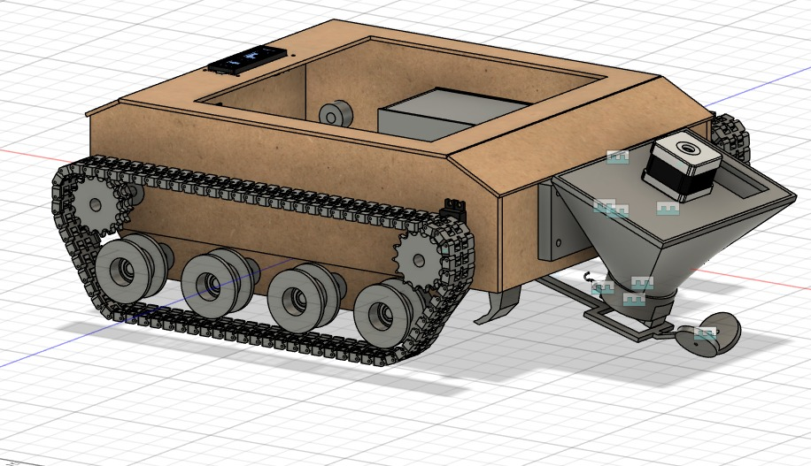
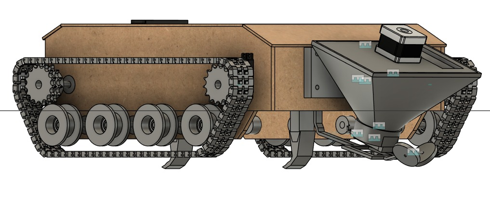
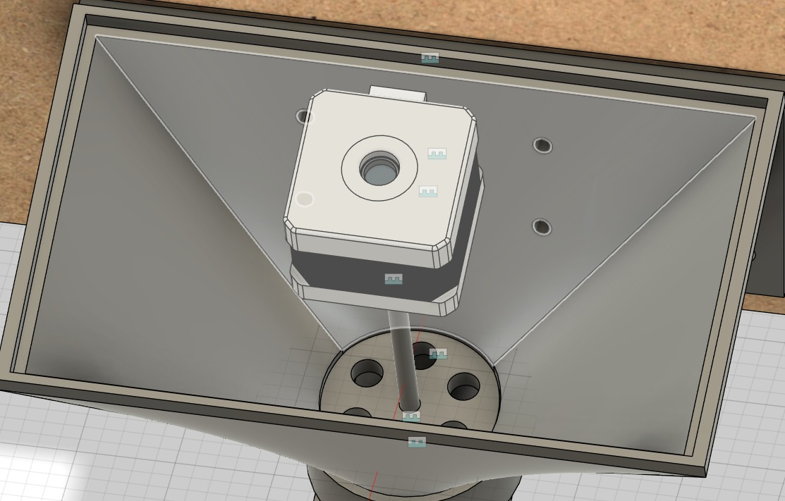
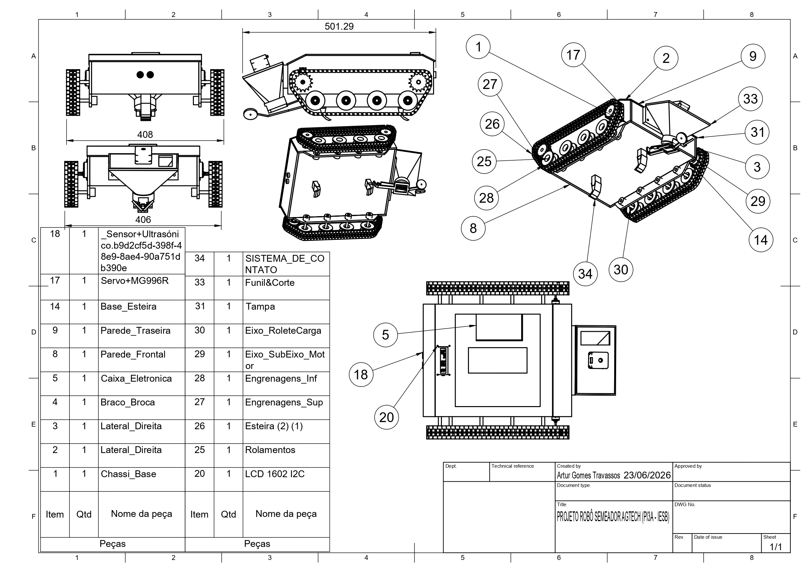

# 🚜 Robô Semeador (PI3A - IESB)

*Protótipo autônomo para semeadura de precisão desenvolvido para a disciplina de Projeto Integrador 3A.*

## 📌 Visão Geral
O **Robô Semeador** é uma solução de engenharia mecatrônica projetada para automatizar o plantio em pequenas e médias propriedades. O sistema integra locomoção por esteiras, um sulcador de solo de troca rápida e um mecanismo dosador de sementes alveolar de alta precisão.

---

## 🛠️ Arquitetura Mecânica

### 📏 Dimensões e Estrutura
O chassi foi projetado para suportar ambientes agrícolas, utilizando uma estrutura robusta de **MDF de 6mm** (corte a laser) e componentes de alta performance.

*   **Comprimento Total:** 501.29 mm
*   **Largura Externa:** 408 mm
*   **Sistema de Tração:** Lagartas articuladas para baixa compactação do solo e alta aderência.

### ⚙️ Design Paramétrico (Fusion 360)
A modelagem foi realizada de forma 100% paramétrica, permitindo ajustes dinâmicos através da tabela de parâmetros:

| Parâmetro | Valor | Descrição |
| :--- | :--- | :--- |
| `MDF` | 6.00 mm | Espessura das chapas do chassi |
| `Largura_Robo` | 288.00 mm | Largura base da estrutura |
| `Comprimento_Robo` | 388.00 mm | Comprimento base da estrutura |
| `Folga` | 0.20 mm | Tolerância geral para encaixes laser |
| `tolerancia_3d` | 0.15 mm | Folga dimensional para encaixes impressos |
| `haste_comprimento`| 50.00 mm | Extensão do sulcador |

---

## 🏗️ Subsistemas Específicos

### 1. Sistema de Contato com o Solo
Dividido em dois módulos técnicos fundamentais baseados em **DfAM (Design for Additive Manufacturing)**:

*   **Módulo A (Sulcador):** Utiliza um encaixe **Dovetail (Rabo de Andorinha)** de 16mm para permitir a substituição manual da **Botinha Sacrificial**. A botinha possui ângulo de ataque de 25° para otimização do arrasto.
*   **Módulo B (Braço Flexível):** Um mecanismo compliante em arco parabólico (PETG) que elimina a necessidade de molas metálicas, garantindo suspensão e pressão constante para a **Roda Compactadora (TPU 95A)**.

### 2. Mecanismo de Semeadura
O reservatório inclinado conta com um disco alveolar interno para singulação de sementes.
*   **Dosagem:** Controlada por Motor de Passo para precisão milimétrica.
*   **Inovação:** Sistema de raspador/escova interno para evitar o entupimento e garantir que apenas uma semente seja liberada por vez.

---

## ⚡ Eletrônica e Controle
O cérebro do robô é baseado na plataforma Arduino, gerenciando a locomoção e a semeadura simultaneamente.

*   **Microcontrolador:** Arduino Uno/Nano.
*   **Drivers:** A4988 (Passo) e Shields para motores CC (Tração).
*   **Interface:** LCD 1602 I2C para exibição de status e telemetria.
*   **Sensores:** Sensor Ultrassônico para desvio automático de obstáculos.
*   **Atuadores:** Servo Motor MG996R para controle de fluxo auxiliar.

---

## 🧪 Materiais e Fabricação

| Componente | Material | Processo |
| :--- | :--- | :--- |
| Estrutura Principal | MDF 6mm | Corte a Laser |
| Haste e Braço |  | Impressão 3D (FDM) |
| Roda Compactadora |  | Impressão 3D (FDM) |
| Botinha Sacrificial |  | Impressão 3D (FDM) |

---

## 🔧 Manutenção e Operação
O projeto prioriza o **baixo custo de manutenção**:
1.  **Peça de Desgaste:** A Botinha Sacrificial deve ser trocada via deslizamento axial sempre que o bico de ataque sofrer erosão significativa.
2.  **Limpeza:** O disco alveolar é removível para limpeza do reservatório.

---

## 👥 Autores
*   **Artur Gomes Travassos** - Modelagem, Projeto Mecânico e Documentação.
*   **Instituição:** IESB - Engenharia Mecatrônica.
*   **Disciplina:** PI3A.

---
*Documentação gerada em Junho de 2026.*

